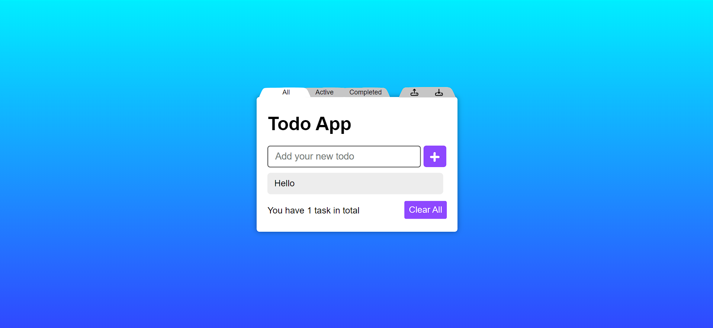

<h1>Todo-App-Firebase🗂</h1>

<h2>Introduction</h2>

    Welcome to the Todo App with Firebase repository! In this project, I've
    created a JavaScript-based Todo app that showcases the integration of
    Firebase for backend services. This app allows users to manage their todos,
    leveraging Firebase to store and retrieve data.

    The code in this repository has been developed professionally and is
    organized into two main sections within the <code>public</code> folder:

<ol>
    <li>
        <strong>Todo Files</strong>: Contains the core files for the Todo app.
    </li>
    <li>
        <strong>Work-w-firebase</strong>: Includes base files that demonstrate
        how to interact with Firebase to send and retrieve data using both the
        traditional and snapshot methods.
    </li>
</ol>
<h2>Getting Started</h2>

To run the code locally on your machine, follow these steps:

<ol>
    <li>
Clone or download this repository to your local system.
</li>
    <li>
        

            Open a terminal in the repository's folder and run the following
            command:
        

        <pre>
            <code>
                firebase serve
            </code>
        </pre>
    </li>
    <li>
        

            Open your web browser and navigate to
            <a href="http://localhost:5000/" target="_new"
                >http://localhost:5000/</a
            >
            to access the running code.
        

    </li>
</ol>

    Alternatively, you can also experience the live demo of the app at
    <a href="https://ali-sdg9093-todo-app.web.app/" target="_new"
        >https://ali-sdg9093-todo-app.web.app/</a
    >.

<h2>Features</h2>

This Todo app offers the following features:

<ul>
    <li>
        

            <strong>Add Tasks</strong>: You can add tasks by typing into the
            input field and clicking the "Add" button.
        

    </li>
    <li>
        

            <strong>Filter Tasks</strong>: Tasks can be filtered by clicking the
            "All," "Active," or "Completed" buttons.
        

    </li>
    <li>
        

            <strong>Clear Tasks</strong>: Easily clear all tasks by clicking the
            "Clear" button.
        

    </li>
    <li>
        

            <strong>Persistence</strong>: Tasks are saved to Firebase, ensuring
            they persist even after the browser is closed or refreshed.
        

    </li>
</ul>
<h2>Code Structure</h2>

    The code is well-organized and utilizes various variables to interact with
    the HTML elements and Firebase:

<ul>
    <li>
        

            <code>addBtn</code>, <code>todoCounter</code>,
            <code>pendingFilter</code>,
            <code>clearAll</code>, <code>todoInput</code>,
            <code>todoList</code> are used to select
            different parts of the HTML for manipulation.
        

    </li>
    <li>
        

            An array named <code>todoSaves</code> is employed to store tasks,
            while another array, <code>filteredTodoSaves</code>, is used to
            store filtered tasks. The
            <code>filterTodoSavesFunc()</code> function filters tasks based on
            the filter mode (<code>all</code>, <code>active</code>, or
            <code>completed</code>). The
            <code>updateHTML(addNewTodo)</code> function refreshes the DOM to
            display the list of tasks.
        

    </li>
</ul>
<h2>Steps</h2>
<table>
    <thead>
        <tr>
            <th>Steps</th>
            <th>Github</th>
            <th>JSFiddle</th>
            <th>Live Demo</th>
            <th>Showcase Video</th>
        </tr>
    </thead>
    <tbody>
        <tr>
            <td>Step 3 (base file)</td>
            <td><a href="https://github.com/Ali-Sdg90/Todo-App/tree/2471d1bfbd34de78b451684a90d3c6db4ac20350" target="_new">Link</a></td>
            <td><a href="https://jsfiddle.net/Ali_Sdg90/v60okbum/" target="_new">Link</a></td>
            <td>---</td>
            <td>Coming soon...</td>
        </tr>
        <tr>
            <td>Step 4 (todo btns + SCSS)</td>
            <td><a href="https://github.com/Ali-Sdg90/Todo-App" target="_new">Link</a></td>
            <td><a href="https://jsfiddle.net/Ali_Sdg90/k4Lwxare/" target="_new">Link</a></td>
            <td>---</td>
            <td>Coming soon...</td>
        </tr>
        <tr>
            <td>Step 5 (knockout.js)</td>
            <td><a href="https://github.com/Ali-Sdg90/Todo-App-KnockoutJS" target="_new">Link</a></td>
            <td><a href="https://jsfiddle.net/Ali_Sdg90/v7nac15g/4/" target="_new">Link</a></td>
            <td><a href="https://ali-sdg90.github.io/Todo-App-KnockoutJS/">Link</a></td>
            <td>Coming soon...</td>
        </tr>
        <tr>
            <td>Step 6 (localStorage)</td>
            <td><a href="https://github.com/Ali-Sdg90/Todo-App" target="_new">Link</a></td>
            <td><a href="https://jsfiddle.net/Ali_Sdg90/tz105ux4/1/" target="_new">Link</a></td>
            <td><a href="https://ali-sdg90.github.io/Todo-App/">Link</a></td>
            <td>Coming soon...</td>
        </tr>
        <tr>
            <td>Step 6 (Firebase)</td>
            <td><a href="https://github.com/Ali-Sdg90/Todo-App-Firebase" target="_new">Link</a></td>
            <td><a href="https://jsfiddle.net/Ali_Sdg90/bfLrwtxg/2/" target="_new">Link</a></td>
            <td><a href="https://ali-sdg9093-todo-app.web.app/">Link</a></td>
            <td>Coming soon...</td>
        </tr>
    </tbody>
</table>

Enjoy using the app❤️
